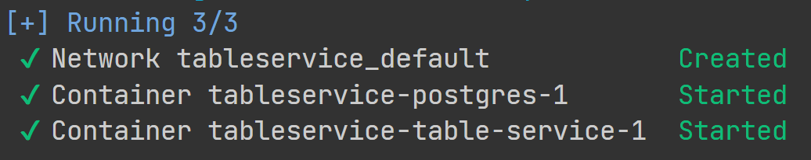
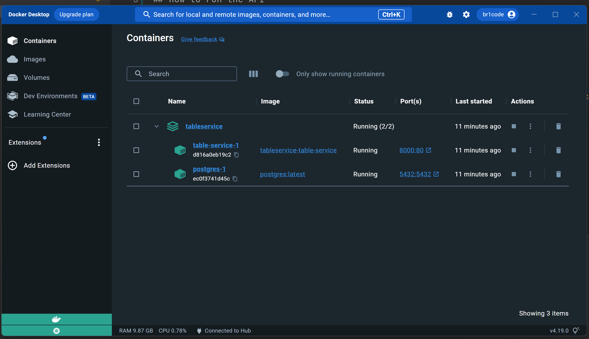
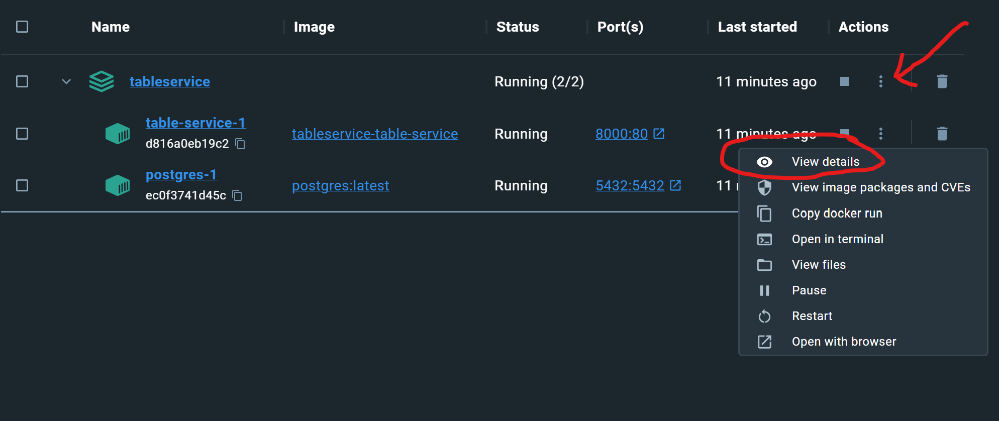
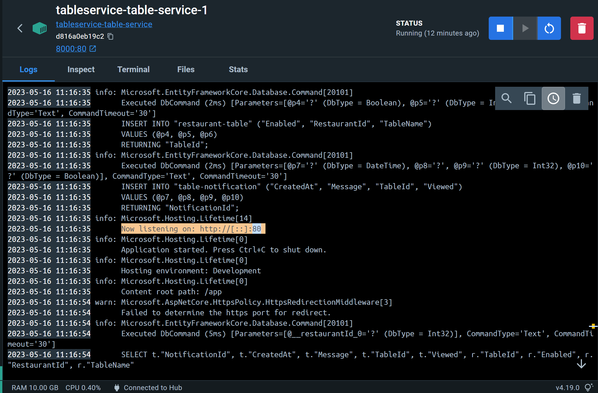

# TableService

## How to run the API

### Prerequisites:

- Make sure to have Docker installed
- If you have PostgreSQL installed locally, please uninstall it and just run a container.

### Steps:

1. Open a terminal and move to the `TableService` folder that contains a `docker-compose.yml` file.
2. Run `docker-compose up --build -d`. Compare your results:
    - Check your terminal 
    - Open Docker Desktop -> Containers 
    - Click `View details` in the `table-service-1` container. This container has .NET installed and is running our application. 
    - Find this log: `Now listening on: http://[::]80` 
    - Docker was configured (see `docker-compose.yml` file) to start both services in different containers, but make the API wait for the postgres to be ready to accept connections before trying to create the database and seed it with test data. That's why we created a simple .sh script for that (see `wait-for-postgres.sh` file) to loop until the db is ready to be used.
3. Open http://localhost:8000/swagger/index.html and try it out. 

The API will be listening to the port 8000 locally. 

**Note: the API base url is http://localhost:8000**